# POC CloudEvents - Padronização de Eventos

## Objetivo

Demonstrar a viabilidade de adotar o padrão **CloudEvents** (CNCF) para padronizar a comunicação assíncrona entre serviços, independente da linguagem ou plataforma.

---

## O que é CloudEvents?

[CloudEvents](https://cloudevents.io/) é uma **especificação da CNCF** (Cloud Native Computing Foundation) que define um formato padrão para descrever eventos. É agnóstico a:

- **Linguagem** (C#, Node.js, Python, Java, Go, etc.)
- **Transporte** (HTTP, Kafka, AMQP, NATS, etc.)
- **Cloud Provider** (AWS, Azure, GCP, on-premises)

### Atributos obrigatórios de um CloudEvent

| Atributo        | Tipo      | Descrição                                         |
|-----------------|-----------|---------------------------------------------------|
| `specversion`   | String    | Versão da spec (atualmente `1.0`)                 |
| `id`            | String    | Identificador único do evento                     |
| `type`          | String    | Tipo do evento (ex: `com.example.order.created`)  |
| `source`        | URI-ref   | Origem do evento (quem produziu)                  |

### Atributos opcionais (mas recomendados)

| Atributo           | Tipo      | Descrição                              |
|--------------------|-----------|----------------------------------------|
| `time`             | Timestamp | Quando o evento ocorreu                |
| `datacontenttype`  | String    | MIME type do data (ex: `application/json`) |
| `data`             | Any       | Payload do evento                      |
| `subject`          | String    | Assunto do evento dentro do source     |

### Extension Attributes

CloudEvents permite **extensões customizadas** para necessidades específicas:

```json
{
  "correlationid": "order-123",
  "partitionkey": "order-123",
  "traceparent": "00-abc123-def456-01"
}
```

| Extension        | Propósito                                        |
|------------------|--------------------------------------------------|
| `correlationid`  | Rastreamento de fluxos distribuídos entre serviços |
| `partitionkey`   | Roteamento/ordenação em brokers (Kafka, etc.)     |
| `traceparent`    | Integração com OpenTelemetry/Jaeger/Zipkin        |

---

## Arquitetura da POC

```mermaid
flowchart TD
    Client["🖥️ Cliente (curl / test.sh)"]

    Client -- "POST /api/events/order-created\nPOST /api/events/order-shipped" --> Producer

    subgraph Producer["Producer C# — ASP.NET :5001"]
        P1["Cria CloudEvent v1.0\n(id, type, source, correlationid)"]
        P2["Serializa em Structured Mode\napplication/cloudevents+json"]
        P1 --> P2
    end

    Producer -- "POST /api/events\nCloudEvents HTTP" --> CD
    Producer -- "POST /api/events\nCloudEvents HTTP" --> CN
    Producer -- "POST /api/events\nCloudEvents HTTP" --> CP

    subgraph Consumers["Consumers — Multilinguagem"]
        CD["🟣 Consumer C#\nASP.NET :5002"]
        CN["🟢 Consumer Node.js\nExpress :3002"]
        CP["🔵 Consumer Python\nFlask :8000"]
    end

    CD -- "GET /api/events" --> Client
    CN -- "GET /api/events" --> Client
    CP -- "GET /api/events" --> Client

    style Producer fill:#2d6a4f,stroke:#1b4332,color:#fff
    style Consumers fill:#1a1a2e,stroke:#16213e,color:#fff
    style CD fill:#512da8,stroke:#311b92,color:#fff
    style CN fill:#2e7d32,stroke:#1b5e20,color:#fff
    style CP fill:#1565c0,stroke:#0d47a1,color:#fff
    style Client fill:#e65100,stroke:#bf360c,color:#fff
```



**Ponto-chave**: O producer C# envia o mesmo evento para **3 consumers em linguagens diferentes**, demonstrando que:
- O mesmo CloudEvent produzido em **C#** é consumido corretamente por **C#**, **Node.js** e **Python**
- O formato é **auto-descritivo** — o consumer não precisa conhecer o producer previamente
- Os SDKs oficiais da CNCF garantem interoperabilidade entre linguagens

---

## Exemplo de um CloudEvent (HTTP Structured Mode)

Quando o Producer C# envia um evento `order.created`, o HTTP request fica:

```http
POST /api/events HTTP/1.1
Content-Type: application/cloudevents+json

{
  "specversion": "1.0",
  "id": "a1b2c3d4-e5f6-7890-abcd-ef1234567890",
  "type": "com.example.order.created",
  "source": "/producer-dotnet/orders",
  "time": "2026-02-24T10:30:00Z",
  "datacontenttype": "application/json",
  "correlationid": "order-xyz-123",
  "partitionkey": "order-xyz-123",
  "data": {
    "orderId": "order-xyz-123",
    "customerId": "customer-4521",
    "items": [
      { "productId": "PROD-001", "name": "Notebook Dell", "quantity": 1, "price": 4599.90 },
      { "productId": "PROD-002", "name": "Mouse Logitech", "quantity": 2, "price": 149.90 }
    ],
    "total": 4899.70,
    "currency": "BRL",
    "createdAt": "2026-02-24T10:30:00Z"
  }
}
```

---

## Como executar

### Pré-requisitos

- Docker e Docker Compose

### Subir os serviços

```bash
docker compose up --build
```

### Testar manualmente

```bash
# Criar pedido
curl -X POST http://localhost:5001/api/events/order-created | jq

# Enviar pedido
curl -X POST http://localhost:5001/api/events/order-shipped | jq

# Consultar eventos recebidos em cada consumer
curl http://localhost:5002/api/events | jq   # Consumer C#
curl http://localhost:3002/api/events | jq   # Consumer Node.js
curl http://localhost:8000/api/events | jq   # Consumer Python

# Limpar eventos
curl -X DELETE http://localhost:5002/api/events
curl -X DELETE http://localhost:3002/api/events
curl -X DELETE http://localhost:8000/api/events
```

### Swagger UI

- Producer C#: http://localhost:5001/swagger
- Consumer C#: http://localhost:5002/swagger

---

## Execução local (sem Docker)

```bash
# Terminal 1 - Consumer C#
cd src/consumer-dotnet
dotnet run --urls http://localhost:5002

# Terminal 2 - Consumer Node.js
cd src/consumer-node
npm start

# Terminal 3 - Consumer Python
cd src/consumer-python
pip install -r requirements.txt
python app.py

# Terminal 4 - Producer C#
cd src/producer-dotnet
dotnet run --urls http://localhost:5001
```

---

## SDKs utilizados

| Linguagem | Pacote                                     | Versão |
|-----------|--------------------------------------------|--------|
| C#        | `CloudNative.CloudEvents`                  | 2.8.0  |
| C#        | `CloudNative.CloudEvents.SystemTextJson`   | 2.8.0  |
| C#        | `CloudNative.CloudEvents.AspNetCore`       | 2.8.0  |
| C#        | `Swashbuckle.AspNetCore`                   | 10.1.4 |
| Node.js   | `cloudevents`                              | 8.x    |
| Python    | `cloudevents`                              | 1.11.0 |
| Python    | `flask`                                    | 3.1.0  |

Todos os SDKs de CloudEvents são mantidos pela **CNCF** e seguem a spec CloudEvents v1.0.

---

## Estrutura do projeto

```
poc-cloudevents/
├── docker-compose.yml
├── test.sh
├── README.md
└── src/
    ├── producer-dotnet/          # ASP.NET - Produz CloudEvents
    │   ├── Controllers/
    │   ├── Models/
    │   └── Services/
    ├── consumer-dotnet/          # ASP.NET - Consome CloudEvents
    │   ├── Controllers/
    │   ├── Models/
    │   └── Services/
    ├── consumer-node/            # Express - Consome CloudEvents
    └── consumer-python/          # Flask - Consome CloudEvents
```

---

## Convenção de tipos de evento proposta

```
com.<empresa>.<dominio>.<ação>
```

Exemplos:
- `com.example.order.created`
- `com.example.order.shipped`
- `com.example.user.registered`
- `com.example.user.updated`
- `com.example.payment.processed`
- `com.example.inventory.reserved`
